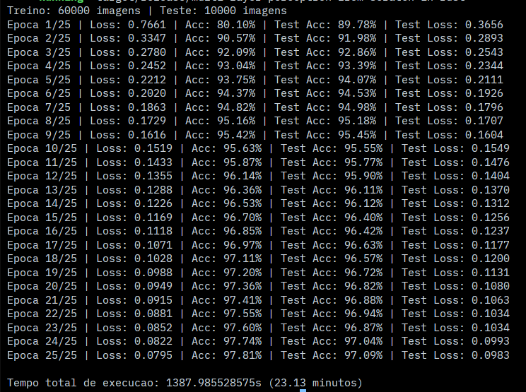
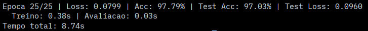
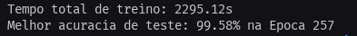

# Multi-Layer Perceptron (MLP) do zero em Rust - MNIST

Este repositório contém a implementação de uma rede neural Multi-Layer Perceptron (MLP) escrita em Rust, sem uso de bibliotecas de Machine Learning.

## Como rodar

1. Rust instalado (`cargo`)
2. Dados do MNIST em `src/data/`
3. Executar em modo release:
   ```bash
   cargo run --release
   ```

*(Hardware: Dell Latitude, Arch Linux, Intel Core i5-1345u, 16GB RAM, sem GPU)*

---

## Arquitetura

- **Topologia:** `[784, 2048, 1024, 10]`
- **Ativações:** `ReLU` (ocultas) e `Softmax` (saída)
- **Otimizador:** Adam com `OneCycleLR`
- **Data Augmentation:** rotação, translação, distorção elástica, blur

---

## Resultados

- **Acurácia Final:** **99.58%** no conjunto de teste
- **Tempo total:** ~38 minutos para 300 épocas

### Comparativo de experimentos

| Experimento | Épocas | Tempo | Acurácia | Notas |
| :--- | :--- | :--- | :--- | :--- |
| **V1 (Ingênua)** | 25 | **23 min 13 s** | 97.09% | `Vec<Vec<T>>`, loops escalares, alocações excessivas |
| **V2 (Otimizada)**| 25 | **8.74 s** | 97.09% | Flat memory, AVX2, Rayon, f32, cache blocking. Ganho de **157x** |
| **V3 (SOTA)** | 300 | ~38 min | **99.58%** | Data Augmentation, Adam + OneCycleLR |

---

## Decisões e dificuldades

### Carregamento dos dados do MNIST

A primeira coisa que eu precisei resolver antes de qualquer outra coisa foi carregar os dados do MNIST. O formato IDX é um formato binário relativamente simples, mas tem uma estrutura específica que precisa ser respeitada rigorosamente, senão os dados saem completamente errados. O arquivo começa com um magic number de 4 bytes que identifica o tipo de dado que está sendo lido (se são imagens ou se são labels), seguido pelo número total de itens no arquivo, número de linhas por imagem e número de colunas por imagem. Todos esses valores estão armazenados em big-endian, o que significa que o byte mais significativo vem primeiro, e é preciso usar `u32::from_be_bytes` para converter corretamente.

Para o arquivo de imagens, o magic number é 2051. Para o arquivo de labels, é 2049. Se o magic number que eu lesse não batesse com esses valores, significava que o arquivo estava corrompido ou que eu estava lendo o arquivo errado. Depois do header, que tem 16 bytes no caso das imagens (4 bytes para o magic number, 4 para o número de imagens, 4 para as linhas e 4 para as colunas) ou 8 bytes no caso dos labels (magic number + número de labels), vêm os dados brutos propriamente ditos. No caso das imagens, é um byte por pixel, com valores variando de 0 a 255, onde 0 representa preto absoluto e 255 representa branco absoluto.

Eu implementei o parsing lendo o arquivo inteiro de uma vez num buffer `Vec<u8>`, verificando o magic number com `u32::from_be_bytes([buf[0], buf[1], buf[2], buf[3]])`, e depois extraindo as dimensões das posições seguintes no buffer. Cada imagem de 28×28 pixels foi achatada num vetor linear de 784 floats, e cada pixel foi normalizado dividindo por 255.0 para ficar no intervalo [0, 1]. Essa normalização é importante porque mantém os valores de input numa faixa consistente, o que ajuda na estabilidade numérica durante o treinamento. Os labels foram lidos diretamente como `usize`, já que são inteiros simples de 0 a 9 representando o dígito que cada imagem corresponde.

Essa parte de carregamento de dados foi tranquila, sendo basicamente leitura binária e conversão de tipos, sem muita complexidade. Mas foi importante validar tudo cedo, porque se os dados estivessem sendo lidos errado, nada ia funcionar depois e eu ia ficar debugando coisas que não tinham problema.

### Operações matriciais manuais

Com os dados carregados e funcionando, eu precisava implementar as operações matriciais que a rede neural usa para fazer os cálculos. Comecei pelo básico: multiplicação matriz-vetor, soma de vetores, produto externo entre dois vetores, e a multiplicação de matrizes propriamente dita com aqueles três loops aninhados clássicos que todo mundo vê na faculdade.

A primeira decisão de implementação, e que acabaria tendo consequências sérias lá na frente, foi representar matrizes como `Vec<Vec<f64>>`. Um vetor de vetores. Cada sub-vetor representava uma linha da matriz. Conceitualmente fazia todo o sentido, pois uma matriz é uma lista de linhas, e cada linha é uma lista de números. E pra quem vem do Python, onde listas dentro de listas são o padrão absoluto, parecia a escolha mais natural do mundo.

Só que essa escolha me rendeu um bom tempo batendo a cabeça. Ter que ficar pensando nos índices de linhas e colunas para cada multiplicação e cada adição era confuso. Quando eu precisava acessar `matrix[i][j]`, eu tinha que lembrar que o primeiro índice é a linha e o segundo é a coluna, e que para multiplicar duas matrizes, o número de colunas da primeira tem que ser igual ao número de linhas da segunda. Para transpor uma matriz, eu tinha que trocar linhas por colunas. Para somar duas matrizes, elas tinham que ter exatamente as mesmas dimensões. Tudo isso exigia atenção constante aos índices, e qualquer erro de off-by-one resultava em pânico de bounds check ou, pior, em resultados silenciosamente errados.

A parte do loop de treinamento em si, onde eu iterava sobre os batches e chamava o forward pass, foi relativamente tranquila de implementar. O backpropagation, por outro lado, foi outro obstáculo completamente diferente. A ideia de cálculo de pesos, matrizes de gradiente, e como o erro flui de trás pra frente pela rede era muito confusa no começo. Eu entendia a teoria de forma abstrata: derivada da cross-entropy, chain rule, gradientes que fluem de trás pra frente. Mas na hora de traduzir isso em código, em multiplicações de matrizes com os shapes corretos, eu me perdi algumas vezes.

O que acontece no forward é o seguinte: para cada camada, eu faço `Z = X @ W.T + b`, onde `X` é o input com shape `(batch, n_in)`, `W` é a matriz de pesos com shape `(n_out, n_in)`, e `b` é o bias com shape `(n_out)`. A transposta de `W` é necessária porque os pesos estão guardados como `(out, in)` mas a multiplicação precisa de `(in, out)` para que as dimensões internas batam.

No backward, para calcular o gradiente dos pesos de uma camada, a fórmula é `dW = (1/batch) * Delta.T @ A`, onde `Delta` é o erro daquela camada com shape `(batch, n_out)` e `A` é a ativação da camada anterior com shape `(batch, n_in)`. Transpondo o Delta para `(n_out, batch)` e multiplicando por `(batch, n_in)`, o resultado é `(n_out, n_in)`, que é exatamente o mesmo shape de `W`. Isso faz sentido porque cada elemento de `dW` diz o quanto aquele peso específico contribuiu para o erro total.

Para propagar o erro à camada anterior, a fórmula é `Delta_prev = Delta_next @ W`. O `Delta_next` tem shape `(batch, n_out_next)` e `W` tem shape `(n_out_next, n_in)`, então o resultado é `(batch, n_in)`, que é o shape correto para o delta da camada anterior.

Com um pouco de estudo, desenhando os shapes no papel e acompanhando passo a passo com exemplos numéricos pequenos, consegui montar uma esquemática de como o backpropagation funcionava na minha cabeça. Depois que isso clicou, a rede passou a treinar.

### O problema da "Dying ReLU"

Antes mesmo de ver a acurácia subir, tive um obstáculo chato logo na primeira tentativa: inicializei os pesos aleatórios de forma muito negativa. Como a ativação nas camadas ocultas era a ReLU (que zera qualquer valor negativo), a rede sofreu do famoso problema da **"dying ReLU"**. Os sinais negativos zeravam as saídas, os gradientes ficavam zerados no backpropagation, e a rede inteira "morria" na primeira camada sem aprender nada.

Tive que pesquisar e implementar a **He Initialization** (ou inicialização de Kaiming), que ajusta o desvio padrão da aleatoriedade matematicamente de acordo com o número de neurônios de entrada (`sqrt(2.0 / n_in)`). Só com esse cuidado a rede passou a aprender corretamente.

### Primeiro resultado funcional

Na minha primeira versão, eu já tinha conseguido bater a meta da disciplina (>= 92% de acurácia). Na verdade, já na terceira época de um treinamento das 25 épocas eu já havia batido os 92%. Eu poderia perfeitamente ter parado por ali e entregue o projeto, pois os requisitos já estavam cumpridos com folga. A rede funcionava, aprendia, e com uma acurácia muito acima do mínimo exigido.

Porém, como um grande fã de Rust, tinha algo que me incomodava profundamente: a velocidade. O tempo de treino: 23 minutos e 13 segundos.



Naquele momento, eu poderia ter parado. Os requisitos estavam cumpridos, a acurácia estava boa, o código funcionava. Mas 23 minutos para 25 épocas me incomodava. Meu processador é um i5-1345u, não é um hardware limitado. Tinha algo de errado acontecendo, alguma ineficiência fundamental que estava desperdiçando o potencial da máquina.

Foi aí que eu decidi investigar onde o tempo estava sendo gasto e ver o que dava pra melhorar. Não estava nos planos iniciais (o projeto era só fazer uma MLP funcional), mas virou uma parte significativa do projeto. Confesso que foi uma das partes que eu mais me diverti, talvez até mais do que tentar alcançar a acurácia máxima. Tem algo de muito satisfatório em pegar um código que demora 23 minutos e, através de ajustes cirúrgicos, ver o tempo cair para segundos. Cada otimização aplicada era uma vitória mensurável, e o processo de entender como a CPU funciona por baixo dos panos acabou sendo mais recompensador do que simplesmente ver a acurácia subir.

Foi aí que comecei minha busca incessante por performance.

### Flat memory

Para quem só programou em Python na vida, a forma como a memória e a CPU funcionam pode parecer invisível, mas quando você desce para o baixo nível (C/Rust), a arquitetura da máquina dita as regras do jogo.

A primeira mudança que eu fiz foi abandonar os vetores dentro de vetores e criar um único vetor gigante e contínuo, o que chamam de *flat memory*. Passei a acessar as linhas e colunas através de uma fórmula matemática simples: `índice = y * largura + x`. Como a memória agora estava enfileirada perfeitamente, o processador conseguia engolir blocos inteiros de dados de uma vez, ao invés de ficar pulando de um endereço aleatório para outro na RAM.

O motivo técnico por trás disso é o seguinte: a CPU não lê um byte por vez da memória RAM. Ela lê blocos de 64 bytes chamados cache lines e coloca no cache L1, que é uma memória interna minúscula mas absurdamente rápida. Se o próximo acesso estiver dentro da mesma cache line, é um cache hit, já que o dado já está lá e o acesso custa aproximadamente 1 ciclo de clock. Se estiver em outro endereço aleatório da RAM, é um cache miss, exigindo que a CPU espere aproximadamente 100 ciclos para o dado chegar da RAM. Com `Vec<Vec<f64>>`, as linhas da matriz estavam em endereços aleatórios, causando cache misses constantes. Com flat memory, tudo estava sequencial, e o prefetcher da CPU conseguia prever os acessos corretamente.

Inclusive, eu fui além do prefetcher automático. No loop de avaliação, implementei o conceito de *Software Prefetching* com a instrução intrínseca `_mm_prefetch`. Eu literalmente programava a CPU para ir buscar a imagem *seguinte* na RAM e deixá-la na cache L1 antes mesmo de terminar de processar a imagem atual. Ocultar essa latência de memória fez um diferencial absurdo.

Curiosamente, essa ideia me lembrou muito um conteúdo que eu estava estudando enquanto fazia meu mini-kernel em Rust: nos computadores antigos, os registradores de 16-bits da Intel só conseguiam endereçar 64KB de RAM. Para resolver isso, eles criaram um sistema indireto de segmentação que simulava um registrador de 20-bits, alcançando até 4GB de memória. Foi exatamente dessa lógica de endereçamento inventado que lembrei ao fazer a minha flat memory. Sei que não tem nada a ver diretamente (um é sobre limitação de bits de endereçamento e o outro é sobre localidade de cache), mas achei legal mencionar porque foi uma conexão que fiz na hora e que me deu confiança de que estava no caminho certo.

### O custo escondido do heap

Outra otimização que eu fiz foi em relação ao heap, que é onde os vetores dinâmicos do Rust são alocados. Percebi que sempre que eu fazia um `Vec::new()` para criar um vetor vazio ou um `vec.push()` para adicionar algo, muitas vezes o processador tinha que realocar o vetor totalmente para outros locais da memória que coubessem o novo tamanho aumentado.

Isso acontece porque o `Vec` em Rust funciona de forma similar ao `ArrayList` do Java ou ao `vector` do C++: ele começa com uma capacidade pequena e vai dobrando de tamanho conforme enche. Toda vez que a capacidade se esgota, o allocator do sistema operacional precisa alocar um novo bloco de memória com o dobro do tamanho, copiar todos os dados existentes pro novo bloco (uma operação `memcpy`), e liberar o bloco antigo. Isso acontecia milhares e milhares de vezes durante o treino, e cada realocação significava tempo de CPU gasto copiando dados ao invés de calculando gradientes.

Foi aí que eu usei a ideia de pré-criar os vetores com o tamanho exato que eu iria precisar. Dessa forma, eu já deixava um espaço exato e reservado no heap do que iria precisar, liberando o processador de ter que ficar realocando toda hora. Criei uma struct `BatchCache` que armazena todos os buffers intermediários (pré-ativações, ativações e deltas) com os tamanhos calculados matematicamente antes do treino começar. Durante o treino, os buffers são reutilizados via `copy_from_slice` e sobrescrita direta. Zero alocações durante o treinamento.

### SIMD: Single Instruction, Multiple Data

Uma das otimizações mais legais que eu fiz foi em relação a algo que aprendi na minha busca por performance: o SIMD (*Single Instruction, Multiple Data*).

Resumindo de forma bem prática: ao invés de eu fazer várias operações de soma sequenciais, tipo:
```
add r1, r2 => r3
add r3, r4 => r5
add r5, r6 => r7
```
Onde cada instrução processa um par de números por vez, eu pego todos os números e coloco num registrador especial de 256 bits, e executo uma única instrução para somar tudo de uma vez. O nome é autoexplicativo: uma única instrução, múltiplos dados.

No meu código, usei os intrinsics AVX2 (`_mm256_*`) para processar 8 floats por instrução nos loops de bias + ReLU e no SGD update. Por exemplo, no loop de ReLU, ao invés de fazer `if val > 0.0 { val } else { 0.0 }` para cada elemento individualmente, eu carrego 8 elementos num registrador, comparo todos com zero de uma vez usando `_mm256_max_ps`, e escrevo os 8 resultados de volta na memória. Isso substitui 8 iterações de um loop `for` por uma única instrução de CPU.

Outra coisa absurda do SIMD que aproveitei foi o FMA (*Fused Multiply-Add*). Em vez de fazer uma multiplicação e depois uma adição (duas operações separadas nas contas do update), eu usei a instrução `_mm256_fmadd_ps`. Ela faz a multiplicação e a adição simultaneamente, no mesmo exato ciclo de clock do processador. Além de ser instantâneo, evita perda de precisão e erros de arredondamento no ponto flutuante.

### GEMM e a integração com C (cblas-sys)

Além do SIMD nos loops manuais, o maior gargalo no treinamento de qualquer rede neural é sempre a multiplicação de matrizes. Existem bibliotecas C de álgebra linear de alta performance, como a Intel MKL (Math Kernel Library) ou o OpenBLAS, que foram desenvolvidas por engenheiros especializados especificamente para fazer esses cálculos na máxima velocidade possível, tirando proveito de cada transistor do processador.

O processo que elas usam é de quebrar a multiplicação de uma matriz gigante em fragmentos tão pequenos que seja possível otimizar para usar a memória cache L1 para guardar os valores intermediários. O cache L1 é uma memória interna minúscula da CPU (tipicamente 32KB), mas absurdamente rápida comparada com a RAM. Quando os dados cabem inteiros no L1, a CPU não precisa esperar a RAM, pois ela pega tudo do cache e calcula sem nunca parar. Isso faz uma diferença brutal, especialmente quando você está fazendo centenas de milhares de multiplicações de matrizes durante o treino.

Além do cache blocking (ou tiling), essas bibliotecas usam packing buffers (reorganizam os dados antes de computar para garantir acesso sequencial à memória), micro-kernels vetorizados (usam instruções SIMD internamente para processar múltiplos elementos por instrução), e paralelização multi-thread (dividem o trabalho entre os núcleos do processador). Implementar tudo isso do zero em Rust seria um gigantesco projeto por si só. Então, eu decidi descer ainda mais o nível: utilizei a crate `cblas-sys`. Ela faz uma ponte FFI (*Foreign Function Interface*) direto para as bibliotecas C do sistema (como OpenBLAS ou o próprio Intel MKL instalado na máquina). Com isso, eu pude chamar a função brutíssima `cblas_sgemm` do C diretamente no meu código Rust usando o bloco `unsafe`.

### Iteradores, Rayon e unsafe

Tirei a maioria dos loops `for` manuais e troquei por iteradores (`.iter()`), pois o compilador do Rust tem mais facilidade em otimizar essas estruturas. O compilador consegue analisar o fluxo de dados de um iterador e aplicar otimizações como loop unrolling, vectorization automática e eliminação de bounds checks que seriam mais difíceis de aplicar num loop `for` tradicional com índices manuais.

Além disso, usei a crate `rayon` para paralelização, espalhando o esforço de forma paralela em todos os núcleos físicos do processador. A avaliação no conjunto de teste (10.000 imagens), que antes era single-threaded e levava ~1.2 segundos, passou a ser processada em chunks paralelos e caiu para ~0.2 segundos.

Usei também do bloco `unsafe` do Rust para algumas operações de otimizações mais agressivas, coisas que o compilador não poderia verificar se eram seguras, como raw pointers (`*const f32`, `*mut f32`) e acesso direto à memória sem bounds checking. Por isso usei `unsafe`: não porque o código era inseguro, mas porque eu estava assumindo a responsabilidade de garantir a segurança manualmente. Todas essas otimizações massivas fizeram com que o código ficasse um pouco confuso para quem não está acostumado com conceitos de linguagens de baixo nível, e com a ideia de que em Rust, `unsafe` não significa "código ruim", significa que o compilador não pode verificar isso por mim, então eu estou verificando manualmente.

### f64 → f32: quantização

Fiz alguns testes e vi que `f64` tinha um comportamento praticamente igual ao `f32` durante o treinamento da rede neural. Ou seja, as  casas decimais a mais  de precisão do `f64` eram meio que inúteis para os gradientes, já que o ruído intrínseco do SGD (devido à amostragem aleatória de batches) é ordens de magnitude maior que o erro de arredondamento do `f32`. Ter 15 casas decimais de precisão ao invés de 7 não trazia benefício prático nenhum.

Isso otimizou muito, ainda mais por conta do SIMD: como o registrador AVX2 é de 256 bits, com `f64` (que ocupa 64 bits cada) eu só conseguia colocar 4 floats por vez. Agora com `f32` (que ocupa 32 bits cada), eu posso colocar até 8 floats, meio que duplicando a velocidade de fazer contas. Além disso, `f32` ocupa metade da memória, o que significa que cabe o dobro de dados no cache L1, reduzindo ainda mais os cache misses.

### Resultado das otimizações

Todas essas mudanças juntas fizeram o tempo de treino de 25 épocas cair de **23 minutos e 13 segundos** para **8.74 segundos**, mantendo as mesmas épocas, mesma arquitetura e mesmos hiperparâmetros. Um ganho de **157x** de performance.



Cada otimização contribuiu de forma diferente. A flat memory e a eliminação de alocações resolveram os problemas de memória. O GEMM otimizado resolveu o gargalo principal da multiplicação de matrizes. O SIMD acelerou os loops manuais restantes. A troca para f32 dobrou o throughput. O Rayon paralelizou a avaliação. E o profile de release garantiu que o compilador extraísse o máximo de performance possível.

Isso foi muito importante, porque um dos limitantes para eu alcançar maiores taxas de acurácia era literalmente o tempo de processamento. Se cada experimento demorava 23 minutos, eu simplesmente não tinha tempo de testar muitas combinações de hiperparâmetros. Agora que isso não era mais um problema, pude me divertir tentando encontrar a melhor combinação.

### Busca pela acurácia máxima

Eu procurei o recorde mundial de MNIST usando MLP puro. Em um artigo da Universidade de Tokyo de 2015(https://arxiv.org/pdf/1505.03229), eles alcançaram 99.74% de acurácia usando uma rede massiva com técnicas avançadas de regularização. Procurei repetir os passos deles e usei coisas parecidas.

Usei como otimizador o Adam (ou melhor, o **AdamW**). Eu extraí a penalidade L2 da fração de momento e apliquei o *Weight Decay* diretamente no passo de update dos pesos, o que melhora consideravelmente a capacidade da rede de generalizar. Junto com ele, usei o OneCycleLR como scheduler, para mudar o learning rate dinamicamente em tempos diferentes do treinamento, que começa baixo, sobe até um pico e depois decai suavemente. E para evitar overfitting numa rede tão grande, adicionei **Inverted Dropout** (também operando incrivelmente rápido via máscaras SIMD), onde 10% dos neurônios eram desativados no treino, mas os neurônios sobreviventes recebiam um *scaling* matemático compensatório para não onerar a performance da inferência depois.

Além disso, usei algo que achei muito interessante: o Data Augmentation. Resumindo com uma analogia: imagina que você é um aluno e tem uma prova para fazer na semana, e você tem que fazer exercícios para aprender. Se você aprende resolvendo exercícios fáceis, você não tem muito esforço, porém você não consegue resolver os exercícios difíceis quando eles aparecem na prova. Porém, se você treinar aprendendo a resolver exercícios difíceis, você vai ter mais esforço durante o estudo, porém vai saber os exercícios fáceis de letra na hora da prova.

Foi isso que eu fiz. Peguei as imagens de treino e modifiquei elas de forma pesada: desfoquei, rotacionei, translacionei, apliquei distorção elástica, tudo para que o modelo tivesse que se esforçar para aprender o mais difícil. O grande desafio técnico aqui foi que rotacionar matrizes ou aplicar ondas elásticas nos pixels criava "serrilhados" bizarros se eu apenas movesse as posições inteiras. Para deixar as imagens realistas, implementei cálculos de **Interpolação Bilinear**, onde a cor do novo pixel é fundida proporcionalmente usando frações numéricas dos quatro vizinhos ao redor dele.

Na hora de testar, eu coloco a imagem limpa, sem nenhuma modificação. Dessa forma, ele já vai ter aprendido a resolver os difíceis, fazendo com que os fáceis ele acerte mais. Igual ao aluno que estudou com exercícios difíceis e vai tirar de letra a prova de matemática.

Um detalhe muito legal é que isso era perfeitamente visível nos logs: nas últimas épocas do treinamento, a acurácia de treino chegava a ser *menor* que a acurácia de teste. Como as imagens de treino estavam todas deformadas e difíceis, a rede naturalmente errava mais. Mas quando chegava a hora do teste (a "prova" com imagens limpas e normais), a acurácia disparava para cima, provando na prática que o sofrimento do modelo estava dando resultado.

Para aguentar a complexidade do Data Augmentation, escalei a rede para `[784, 2048, 1024, 10]`, contando com 2048 neurônios na primeira camada oculta. Uma rede pequena não teria capacidade suficiente para aprender com imagens tão distorcidas.

Tudo isso, com um ajuste fino de hiperparâmetros e 300 épocas de treinamento, me renderam **99.58%**, bem próximo do recorde mundial de 99.74%. Porém, lembrando: no recorde mundial eles usaram 15.000 épocas, contra 300 do meu. A diferença de 0.19% provavelmente se fecha com mais épocas e mais augmentations, mas o resultado já está muito próximo.



O tempo total dessas 300 épocas foi de 38 minutos. Agora pense: se eu não tivesse feito as otimizações, seriam 23 minutos para cada 25 épocas. Calculando para 300 épocas, daria algo em torno de 4,6 horas. E imagine se eu fizesse na porcaria do Python (sem PyTorch, usando só NumPy, sem BLAS otimizado), daria mais de um dia com certeza.

Tudo isso graças à otimização do código em Rust. Fiz tudo para extrair o máximo da minha maquina: um Dell Latitude com Arch Linux, Intel Core i5-1345u com 16GB de RAM, sem GPU. Se eu tivesse um PC com GPU... bom, aí a história seria outra.

### Limitações

Lembrando que fiz otimizações extremas focadas em arquitetura x86_64 Intel, usando intrinsics AVX2 (`_mm256_*`) que são específicos desses processadores. Se você tentar rodar em AMD ou Mac (Apple Silicon, arquitetura ARM), provavelmente o desempenho vai ser bem pior, ou talvez nem rode. rsrs

No futuro, se eu fosse refazer, equilibraria melhor a balança entre otimização bruta e portabilidade cruzada de hardware. Mas pro aprendizado? Descer até o nível de registrador e entender como a CPU realmente funciona foi a melhor decisão que eu tomei nesse projeto.
