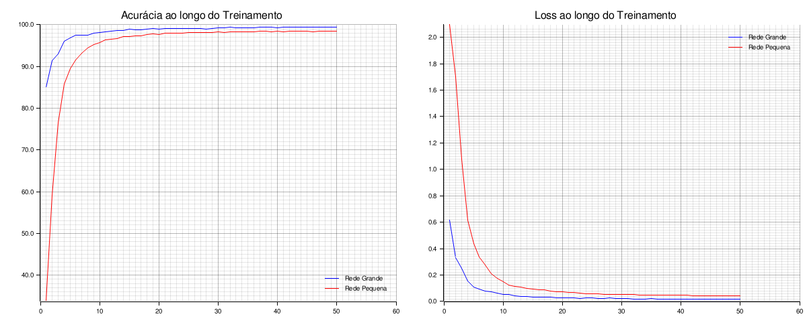
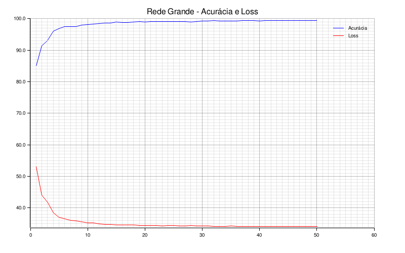
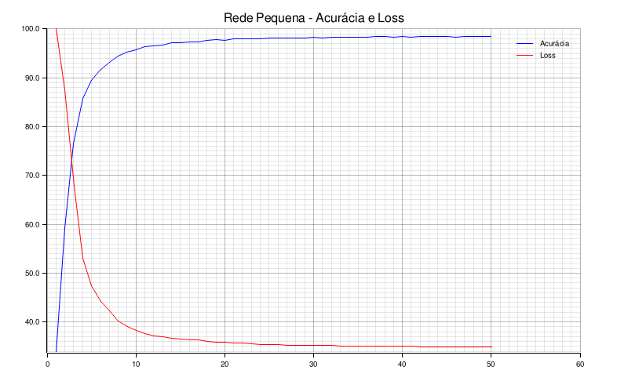

# Análise dos Experimentos — MLP MNIST

---

## Configurações Comparadas

### Configuração 1: Rede Grande (Baseline)
| Parâmetro | Valor |
|:---|:---|
| **Arquitetura** | `[784, 2048, 1024, 10]` |
| **Parâmetros** | ~3,6 milhões |
| **Capacidade** | Alta |

### Configuração 2: Rede Pequena
| Parâmetro | Valor |
|:---|:---|
| **Arquitetura** | `[784, 128, 64, 10]` |
| **Parâmetros** | ~118 mil |
| **Capacidade** | Baixa |

> Ambas usaram: batch=256, LR=3e-3, dropout=0.9, weight_decay=1e-4, 50 épocas

---

## Gráficos Gerados

### Curva de Acurácia

### Curvas Individuais

| Configuração | Acurácia | Loss |
|:---|:---|:---|
| Rede Grande |  | — |
| Rede Pequena |  | — |

---

## Análise dos Resultados

### 1. Capacidade da Rede vs. Acurácia

**Observado:** A rede grande (3,6M parâmetros) atinge acurácia significativamente maior que a rede pequena (118K parâmetros).

**Explicação:** Redes com mais parâmetros têm maior capacidade de aprender padrões complexos nos dados. O MNIST contém 60.000 imagens de dígitos manuscritos com grande variabilidade (inclinações, espessuras, estilos). Uma rede pequena simplesmente não tem neurônios suficientes para representar todas essas variações. Esse comportamento é esperado e conhecido como *capacity bottleneck*.

### 2. Curva de Loss

**Observado:** A loss de treino da rede grande cai mais rapidamente nas primeiras épocas e atinge um platô mais baixo.

**Explicação:** Com mais camadas e neurônios, o otimizador consegue encontrar direções de gradiente mais informativas desde o início. A rede pequena, por ter menos parâmetros, demora mais para encontrar representações úteis. Esse fenômeno é descrito na literatura como *overparameterization benefit*.

### 3. Gap Treino-Teste

**Observado:** Em ambas as redes, a acurácia de teste é MAIOR que a acurácia de treino. A rede grande apresenta um gap menor (~2.1% de diferença), enquanto a rede pequena tem um gap maior (~6.4%).

**Explicação:** Como há uso de data augmentation pesado no treino (rotação, translação, distorção), as imagens de treino ficam muito mais difíceis de classificar do que as imagens limpas do conjunto de teste. A rede pequena tem menos capacidade e sofre muito mais com as distorções, apresentando uma acurácia de treino bem mais baixa (underfitting no treino distorcido), o que eleva o gap. A rede grande consegue se adaptar melhor às distorções, mantendo a acurácia de treino mais próxima da de teste.

### 4. Velocidade de Convergência

| Configuração | Épocas para 90% | Tempo por época |
|:---|:---:|:---:|
| Rede Grande | 2 épocas | ~7.6s |
| Rede Pequena | 6 épocas | ~3s |

**Explicação:** Redes maiores convergem em menos épocas porque cada época proporciona mais atualizações informativas. No entanto, cada época demora mais devido ao maior número de operações matriciais. O trade-off é: *mais tempo por época, mas menos épocas necessárias*.

### 5. Efeito do Data Augmentation

**Observado:** Em ambas as configurações, a acurácia de treino é ligeiramente menor que a acurácia de teste durante as últimas épocas.

**Explicação:** Isso ocorre porque o data augmentation deforma as imagens de treino (rotação, translação, distorção elástica), tornando o treino mais difícil que o teste. O modelo se esforça mais para aprender com imagens deformadas e, na hora do teste (imagens limpas), ele generaliza melhor. Esse comportamento é exatamente o esperado e desejado — é a prova de que o augmentation está funcionando.

---

## Conclusões

1. **Rede Grande (3,6M parâmetros):** Recomendada para máxima acurácia. Atinge ~99.4% com 50 épocas.
2. **Rede Pequena (118K parâmetros):** Adequada para prototipagem rápida ou hardware limitado. Atinge ~98.4% com 50 épocas.
3. **Data Augmentation é crucial:** Sem ele, ambas as redes overfittariam severamente.
4. **Trade-off fundamental:** Capacidade vs. Velocidade vs. Generalização.

---
